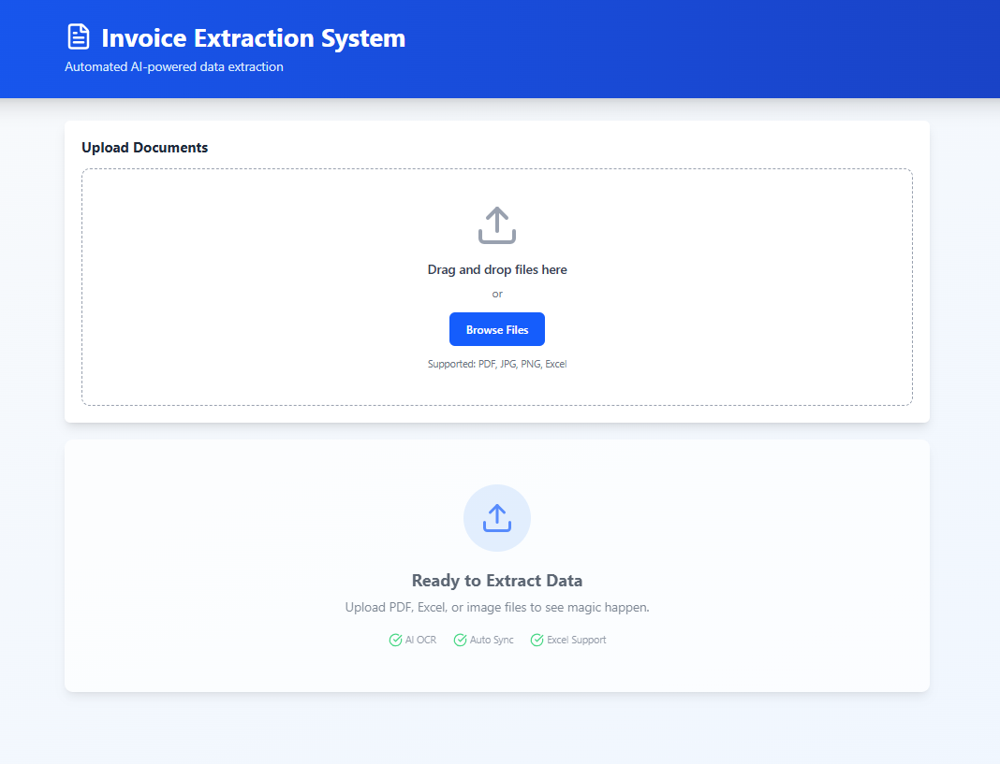
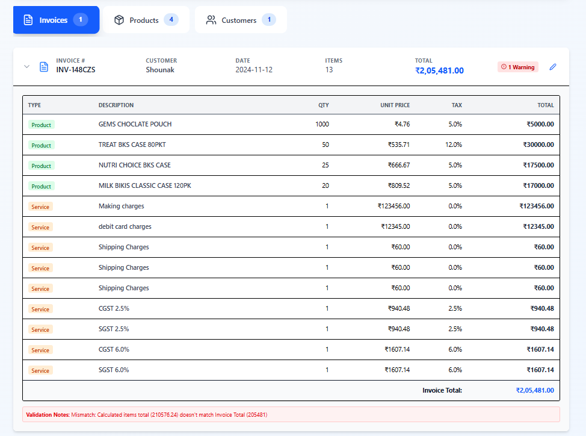
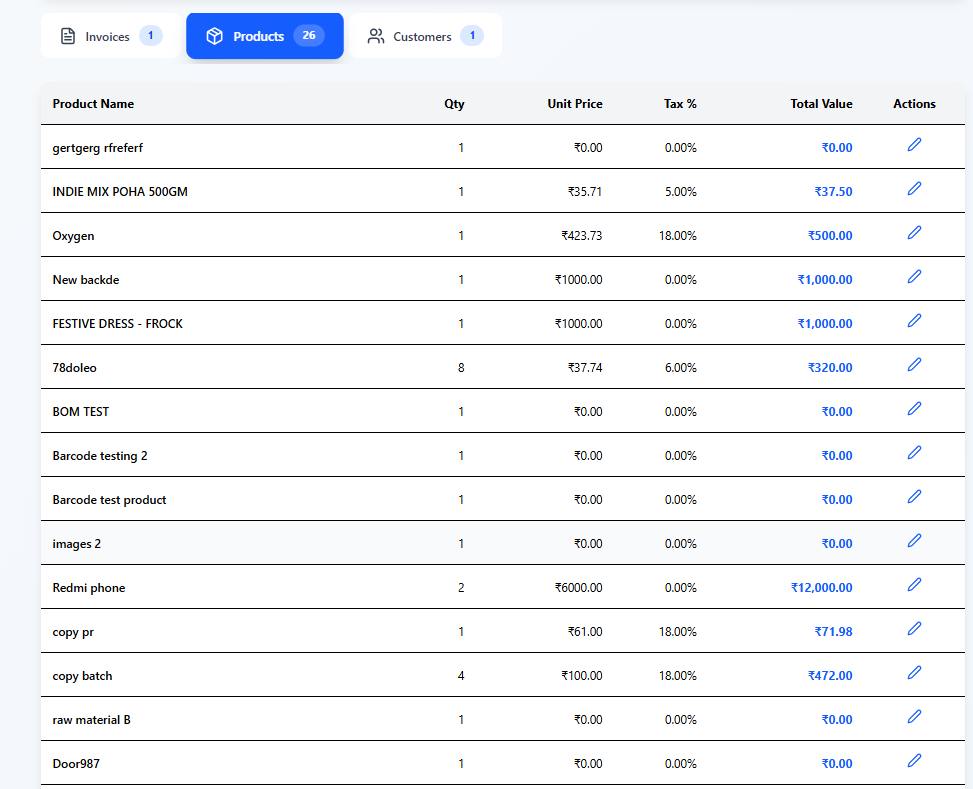
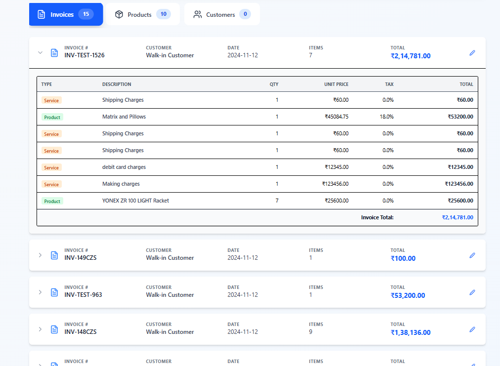

# 📄 Swipe Invoice Manager (AI-Powered)

An intelligent invoice extraction system capable of processing **PDFs, Images, and Excel Bulk Sheets** with a universal parsing engine. Built for the Swipe Assignment.


## 🎥 Project Demo (Video Walkthrough)

Watch the system in action handling duplicate grouping, hidden charges, and bulk excel processing.

[![Watch the video]](https://drive.google.com/file/d/1ttyQPNGqfiUuIua4am3qbbWEq61B7AXw/view?usp=sharing)

> **[Click here to watch the demo video](https://drive.google.com/file/d/1ttyQPNGqfiUuIua4am3qbbWEq61B7AXw/view?usp=sharing)**

 


## 🧠 AI Documentation (How it works?)

I have written a detailed breakdown of the Engineering Architecture, Prompt Engineering strategies, and how I handled edge cases like hallucinations and missing data.

👉 **[Read the Full AI Documentation Here](https://docs.google.com/document/d/1TSRjxMS7XRDxey16abuhdR4dlxU2C-7RnCZ7lBcMzEs/edit?usp=sharing)**

## 🚀 Key Features

-   **Universal AI Parser:** Handles complex layouts, hidden charges (footer items), and messy formatting using Google gemini-2.0-flash.
-   **Smart Grouping Logic:** Automatically detects if multiple rows belong to the same invoice (deduplication) or separate invoices (bulk excel).
-   **Real-Time Sync (Redux):** Editing a product's price/quantity instantly recalculates the Invoice Grand Total and Customer Lifetime Value.
-   **Crash-Proof Excel Handling:** Implemented chunking and safety locks to process large datasets without server timeouts.
-   **Hallucination Control:** Custom prompt engineering prevents AI from inventing fake data (e.g., "Glass") when data is missing.

## 🛠️ Tech Stack

-   **Frontend:** React + Vite, Tailwind CSS, Lucide Icons.
-   **State Management:** Redux Toolkit (Centralized Sync).
-   **Backend:** Node.js, Express.js.
-   **AI Engine:** Google Gemini API (Multimodal Vision & Text).
-   **File Handling:** Multer + XLSX.

---

## ✅ Test Cases Solved

I have successfully handled all edge cases mentioned in the assignment:

| Test Case | Challenge | Status | Solution Implemented |
| :--- | :--- | :--- | :--- |
| **1. Invoice PDF** | Hidden charges (Shipping/Making charges) were missing from table total. | ✅ PASS | Implemented "Footer Extraction Logic" to capture Grand Total accurately. |
| **2. Image + PDF** | Duplicate rows generated for the same invoice. | ✅ PASS | Built a `Universal Grouping Logic` based on Serial Number mapping. |
| **3. Excel (Details)** | Multiple products listed for one invoice. | ✅ PASS | Logic merges items into a single Invoice Card instead of creating duplicates. |
| **4. Excel (Summary)** | Missing Product Names & Serial Numbers. | ✅ PASS | Added "Safe Fallback" to generate unique IDs and categorize generic items as Services. |
| **5. Large Files** | AI Token limit exceeded / JSON Crash. | ✅ PASS | Implemented `slice(0, 75)` safety lock and robust JSON parsing error handling. |

---

## 📸 Screenshots & Proof

### 1. Accuracy Check (PDF Parsing)
*Notice how the system captured the exact Grand Total (₹2,05,481) including hidden charges.*



### 2. Clean Inventory (Products Tab)
*Service charges (Shipping/Tax) are filtered out. Only physical goods shown.*



### 3. Bulk Processing (Excel)
*Successfully processed bulk report with missing serial numbers.*



---

## ⚙️ How to Run Locally

1.  **Clone the Repo**
    ```bash
    git clone [https://github.com/Saurabh8840/InvoicePro.git](https://github.com/Saurabh8840/InvoicePro.git)
    ```

2.  **Backend Setup**
    ```bash
    cd backend
    npm install
    # Create .env file and add GEMINI_API_KEY=your_key_here
    npm start
    ```

3.  **Frontend Setup**
    ```bash
    cd frontend
    npm install
    npm run dev
    ```

---

**Made with ❤️ by Saurabh Tripathi**
